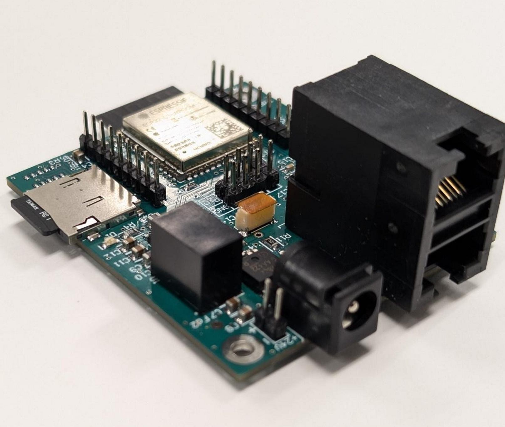

# BaseStation

The base station acts as the controller for the Fish Sense system. It connects to the devices via CAN Bus, and provides power to them. It then connects to the web app over WiFi and the MQTT protocol. It also sends email alerts and provides a basic user interface using buttons, LEDs, a buzzer, and a display.



## Hardware

The base station is powered by the ESP32 S3 WROOM 1 module. The Microchip MCP2551 is used for the CAN Bus interface. Power is provided via a external 24V DC input. This 24V power is provided to the connected devices as well. The 24V going to the devices is switched to allow for controlled power up of the device network. It is also monitored using a current monitroing IC.

## MQTT CAN Bus data format

### Data outgoing from the base station

When data is received from the CAN Bus, it is sent to the web app over MQTT using the following format:

#### Topic:  
``` 
out/[System ID]/[Base Station ID]/[Node ID]/[Message ID] 
```

* System ID: The ID of the system/user. A system can contain several base stations.
* Base Station ID: The ID of the base station.
* Node ID: The ID of the node(attached to the base station) that the message is from.
* Message ID: A unique ID for the message type being sent.

#### Payload:  
``` 
{"data": [Data], "timestamp": [Timestamp]} 
```
* Data: The from the CAN Bus message.
* Timestamp: The time the message was received by the base station.

### Data incoming to the base station

When data is sent from the web app to the base station(to be sent to devices via CAN Bus), it is sent using the following format:

#### Topic:  
``` 
in/[System ID]/[Base Station ID]/[Node ID]/[Message ID] 
```

#### Payload:  
``` 
{"data": [Data], "timestamp": [Timestamp]} 
```

(Other JSON fields are added due to issues with the way the web app sends out MQTT data and are not used by the base station)

## MQTT History Request Format

The web app can request a specific numbers of hours(going back from the current time) for a specific node and message ID with the following format:

#### Topic:  
``` 
historyIn/[System ID]/[Base Station ID]/[Node ID]/[Message ID] 
```

#### Payload:  
``` 
{"hours": [Hours as a interger]} 
```

(Other JSON fields are added due to issues with the way the web app sends out MQTT data and are not used by the base station)

Once the base station receives this request, it will send out the requested data, one hour per MQTT message, in the following format:

#### Topic:  
``` 
historyOut/[System ID]/[Base Station ID]/[Node ID]/[Message ID]/[Hour] 
```

* Hour: The hour of the data being sent. The time is the format: "YYYYMMDDHH"

#### Payload:  
``` {"hour": [Hour Timestamp], 
    "systemID": [System ID],
    "baseStationID": [Base Station ID],
    "nodeID": [Node ID],
    "messageID": [Message ID],
    "history": [{"time": [Message Time], "data": [Message Data]}, ...]}
```
* Hour Timestamp: The unix timestamp(UTC) of the hour being sent. The timestamp of the newest hour being sent will be the current time. Each hour in the past will be the current time minus the number of hours requested.
* History: An array of messages for that hour.
* Message Time: The time the message was received by the base station.
* Message Data: The data from the CAN Bus message.

The number of messages in the "history" array will depend on the number of messages stored for that hour and the number of hours being requested. The more hours requested, the less messages per hour will be sent.

## Device manifest format

The device manifest is used to to communicate the devices connected to the base station to the web app. It also store a human-readable name for each device and the base station itself. When a base station boots up, it sends out its manifest, that is stored in the base station flash, to the web app in the following format:

#### Topic:  
```
manifestOut/[System ID]/[Base Station ID]
```

#### Payload:  
```
{"SystemID":0,
"BaseStationID":0,
"BaseStationName":"Capstone Demo Tank",
"Devices":[{"NodeID":[Node ID],"DeviceType":"[Device Type]]","DeviceName":[Device Name]}, ... ]}

```

* BaseStationName: The human-readable name of the base station(string).
* Devices: An array of devices connected to the base station.
    * NodeID: The ID of the device.
    * DeviceType: The type of device. This must match the device pages and widgets in the web app. Widgets: ```[Device Type]Widget.razor ```, Pages: ```[Device Type]Page.razor```
    * DeviceName: The human-readable name of the device(string).

When the web app wants change the manifest, it sends the new manifest to the base station in the following format:

#### Topic:  
```
manifestIn/[System ID]/[Base Station ID]
```

#### Payload:  
```
{"SystemID":0,
"BaseStationID":0,
"BaseStationName":"Capstone Demo Tank",
"Devices":[{"NodeID":[Node ID],"DeviceType":"[Device Type]]","DeviceName":[Device Name]}, ... ]}

```

The base station will then store this new manifest in its flash and send it back to the web app using the same format as when it boots up.

## WiFi Manager Custom Parameters

The base station uses the WiFi Manager library to manage WiFi connections. The following custom parameters are also used:

* MQTT Server: The IP address of the MQTT server.
* MQTT Username: The username for the MQTT server.
* MQTT Password: The password for the MQTT server.
* Email Recipient: The email address to send alert emails to.
* Email Recipient Name: The name of the email recipient.

These parameters are stored in the base station flash in a JSON file.